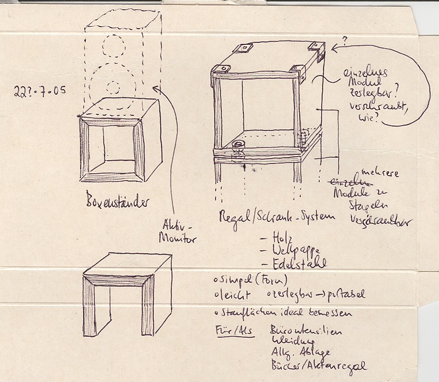
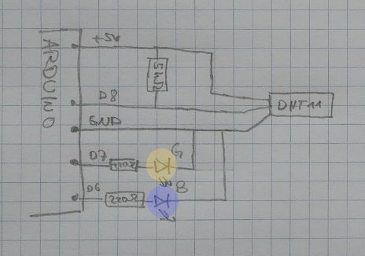

# Hinweise zum Protokoll Facharbeit

# Was sollst du tun?

## Noch bevor das Projekt losgeht

- Dieses Dokument sorgfälig durchlesen und deinen Lehrer bei Unklarheiten löchern :-)
- Ein Thema/Produkt/Kunstwerk/... überlegen
- In einem _One-Pager_ erstellen: Eine Zusammenfassung, was du machen willst, die auf eine DinA-4-Seite passt.
- Mit deinem Lehrer absprechen, ob das so ok ist
- Eine grobe Architektur und einen groben Zeitplan (damit man etwas hat, über das man reden kann) erstellen

## Am Projektanfang

- Architektur, Zeitplan und Rechercheplan ausarbeiten
- Mit eurem Lehrer absprechen

Diese Pläne gebt ihr ab und sie werden dann "archiviert" und separat benotet.
Nach dem Projekt können wir dann sehen, wie nah ihr daran geblieben seid (also wie realistisch sie waren).

## Immer während des Projekts

- Regeläßig Feedback einholen :-)
- Wenn du etwas doof findest/dir etwas fehlt/du etwas nicht verstehst/..., dann nachfragen.
  Wenn dir etwas stinkt, dann sagen, oder in der Datei `AnonymesFeedback` im Projektordner aufschreiben.

## Nach dem Projekt

- Präsentiere dein Projekt deinem Lehrer und der Klasse.
- Erstelle eine Reflektion

# Was sollt ihr abgeben?

Hinweis: die einzelnen Begriffe werden weiter unten genauer erklärt.

Vor Projekt:

- OnePager

Am Anfang:

- Checkliste
- (initialier) Zeitplan und Architektur

Am Ende:

- Dein fertiges Produkt
- Ein Protokoll, das beschreibt, was du getan hast und warum
  - Abgabe: Erstelle einen Ordner im "Tausch"-Ordner `Projekte/NWT Klasse 10/Facharbeit` mit Namen `Facharbeit_<Vorname>_<Nachname>`; der soll alles enthalten, was du abgeben willst: Das Protokoll, Bilder, Videos, ....
  - Format des Protokolls: PDF
  - Dateinamen: Nenne das Protokoll `Protkoll.pdf`, verwende für Bilder/Videos eine Nummerierung; dann kannst du im Protkoll auf "Bild 15" verweisen.
    Nimm die wichtigsten Bilder in das Protkoll selbst mit auf.
    Die Reflektion soll in eine eigene Datei `Reflektion.pdf`, weil sie sich nicht um das eigentliche Produkt dreht, sondern um die Facharbeit.
    Solltest die finale Präsentation per Powerpoint etc. machen, lege diese bitte auch als `Praesentation` mit ab -- du darfst die Präsentation aber auch gerne nur an deinem Produkt oder nur mit dem Protkoll machen.
  - Umfang: So viel wie nötig, so wenig wie möglich.
    Versucht, euch auf das Wesentliche zu reduzieren.
  - Gerne mit vielen Bildern und Diagrammen, wenn sie der Verständlichkeit helfen (verschwendet keine Zeit, Diagramme am PC zu malen -- zeichnet sie auf Stift und Papier und scannt das ein/photographiert das ab).
  - Wenn ihr habt, auch Videos, Audio, ...  Das könnt ihr in den Ordner legen und im Dokument den Dateinamen nennen.

# Wie wird bewertet?

In Klammern siehst du jeweils, wie das in die finale Note eingeht.

Zu deinem Produkt/Projekt: (35%)

- War der Umfang deines Projekts der Facharbeit angemessen (oder hast du zu dir zu wenig Mühe gegeben)
- Du hast selbstständig gearbeitet, es aber nicht versäumt, Feedback einzuholen oder bei Problemen nachzufragen
- In der Ausführung hast du exzellent gearbeitet
- Wenn du gemerkt hast, dass dein Plan nicht optimal war, hast du das schnell erkannt, dir verschiedene Lösungen/Alternativen überlegt, gewissenhaft die beste davon ausgewählt

Allgemeines zu deinem Protokoll: (10%)

- Wie verständlich ist dein Protokoll
  - Wie übersichtlich ist es
  - Wie klar kann man daraus verstehen, was du machen willst
- Hast du es geschafft, dich im Protokoll auf das Wesentliche zu konzentrieren

Zu den einzelnen Blöcken in deinem Protokoll:

1. Vorbereitung: (10%)
    - Es ist klar, was du machen willst
    - Du hast dein Produkt aus verschiedenen Perspektiven betrachtet
    - Es ist klar, warum du diese Anforderungen gewählt hast
    - Deine Checkliste enthält eine gute Auswahl an Anforderungen (also die Anforderungen wirken sinnvoll und du hast keine offensichtlichen vergessen)
1. Planung: (15%)
    - Wie sauber hast du recherchiert
      - Du hast die einzelnen Möglichkeiten so beschrieben, dass man sie versteht
      - Du hast keine naheliegende Möglichkeit übersehen
    - Deine Entscheidungen, für/gegen Möglichkeiten sind nachvollziehbar
    - Dein Plan und deine Architektur beschreiben verständlich, wie du dein Projekt umsetzen willst
    - Dein Zeitplan ist übersichtlich
    - Deine Planung war realistisch (im Nachhinein)
1. Ausführung: (15%)
    - Du hast die einzelnen Schritte deiner Ausführung gut protkolliert
    - Deine Entscheidungen, was Änderungen am Produkt/Plan angeht, sind anchvollziehbar
1. Evaluation: (10%)
    - Du hast alle Anforderungen bewerten können (also ob erfüllt oder nicht)
    - Bei jedem Test, den du durchgeführt hast, versteht man, was du gemacht hast und warum
    - Du hast deine Tests ausreichend dokumentiert
    - Du hast kritisch analysiert, was an deinem Produkt noch besser gemacht werden könnte
    - Du hast dein Produkt mit "Konkurrenzprodukten" verglichen bzw. überlegt, was es für einen Einfluss auf mögliche Käufer hat
1. Reflektion (bei der _Reflektion_ wird nur bewertet, was du Über dich und deine Arbeitsweise schreibst): (5%)
    - Du hast dich kritisch damit auseinandergesetzt, was gut und as verbesserungswürdig lief
    - Du machst konstruktive Vorschläge, wie man es hätte besser machen können

# Die großen Blöcke

Du solltest die folgenden Blöcke bearbeiten.
Die Struktur von deinem finalen Protokoll sollte diese Blöcke wiederspiegeln.

## Vorbereitung

Überlege dir und beschreibe dann, _was_ du umsetzen willst und _warum_.

- Satzschablonen von der Form _Als <Rolle> brauche ich <Ding> um zu <Begründung>_ können dir hier helfen, darauf zu fokussieren, was du mit deinem Projekt machen/zeigen willst.
  Dabei kannst du in verschiedene Rollen schlüpfen (verschiedene Anwender, du selbst als Hersteller, ...) und überlegen, was das Produkt für dich gut/nützlich/attraktiv/... macht.
- Erstelle auch eine "Checkliste" (Liste von [_Anforderungen_](https://de.wikipedia.org/wiki/Anforderung)), die du verwenden kannst, um zu entscheiden, ob deine Planung oder das finale Produkt dem entsprechen, was du eigentlich machen wolltest.
  Idealerweise besteht diese Liste aus lauter Punkten, die man gut abprüfen kann (also die objektiv sind).
  Beispiel: _Der Bleistiftspizer soll Stifte so anspitzen, dass man damit Linien zeichnen kann, die dünner als 0.3mm sind._.

Die Checkliste soll später für die Evaluation verwendet werden.
Deshalb sollte sie die folgene Form haben:

| Anforderung | Erreicht (✓, -, X) | Erklärung |
| --- | :---: | --- |
| Der Bleistiftspizer soll Stifte so anspitzen, dass man damit Linien zeichnen kann, die dünner als 0.3mm sind. | _ _ _ | Matthias will den Bleistiftspitzer in Darstellender Geometrie einsetzen, wo man manchmal sehr feine Linien zeichnen muss. |

## Planung

Überlege dir _wie_ du dein Projekt umsetzen kannst.

- Überlege dir dazu verschiedene Möglichkeiten/Techniken.
  (Hier ist Recherche und Brainstorming gefragt.)
- Analysiere die Vor- und Nachteile davon.
  (Hier ist vor allem Recherche gefragt.)
- Wähle dann die beste Möglichkeit aus und erkläre, warum das die beste ist.
  Es ist nie eindeutig, was _das beste_ ist.
  Es gibt zwei Kategorien von Kriterien:
  - Funktionale:
    Man muss Möglichkeit X wählen, damit das Produkt später besser das tun kann, was es machen soll.
    Diese GrÜnde sind oft technischer Natur.
  - Nicht-funktionale:
    Hier spielen viele andere Faktoren rein, die damit zu tun haben, was man für Rahmenbedingungen hat.
    Beispiele hierfür sind:
    - Zeitbeschränkungen: Ich muss in N Wochen fertig werden, deshalb kann ich diese Methode nicht wählen.
    - Fehlendes Material/Wissen: Ich müsste die Konstruktion eigentlich aus Metall machen, kann aber nicht schweißen.
    - Budget: Die Beschichtung müsste idealerweise aus Gold sein, aber das kann ich nicht finanzieren.
    - Praktikabilität: Ich würde gerne ein 30x30x30cm großes Objekt 3D-drucken, leider dauert der Druck dann Wochen und ich kann nicht oft genug auf Fehler reagieren, deshalb mache ich das Projekt um den Faktor 30 kleiner.

    Um deine Entscheidung, welche der Möglichkeiten du warum gewählt hast, transparent zu machen, verwende eine Tabelle form wie unten in dem Beispiel.
    Die Kriterien und die Möglichkeiten sollten außerhalb der Tabelle genauer beschrieben sein -- nutze die Tabelle, um deine Entscheidung _zusammenzufassen_ und verwende darin Schlagworte.

- Erstelle einen Plan/eine Skizze von deinem Projekt (_was_ du machen willst).
  - die Skizze muss keine technische Zeichnung sein; zeichne von Hand
  - verwende Farben um übersichtlich zu sein
  - Verwende "Sprechblasen" und andere Anmerkungen, in denen du auf wichtige Dinge hinweist (bspw. _Hier muss eine Lücke bleiben, damit man es später auf den Gepäckträger schnallen kann._)
  - Verwende wenn nötig mehrere Skizzen, um dein Problem aus anderen "Blickwinkeln" zu beleuchten (bspw. einen Schaltplan um die Verkabelung zu zeigen und eine 3D-Skizze um zu zeigen, wie die Elektronik eingebaut werden soll).
  - Beispiel siehe unten
- Zerlege dein Projekt in viele kleine Bausteine und überlege dir, wie diese zusammenhängen/zusammenarbeiten.
  Das nennt man auch _Architektur_.
  Diese Bauteine können Hardware und Software sein.
- Erstelle einen (Zeit-)Plan, wann und wie du die einzelnen Bausteine umsetzen willst.
- Erstelle auch eine Liste von Dingen, die du einkaufen/herstellen musst.

### Beispiel für einen Plan

Hier ein Beispiel für einen Plan:
Boxenstative mit Anmerkungen und Notizen
(dankenswerterweise von Niels Heidenreich unter
[CC BY 2.0 Lizenz](https://creativecommons.org/licenses/by/2.0/)
zur Verfügung gestellt).

(Um zu lernen, wie man so einen Plan zeichnet, gibt es
[hier](https://www.instructables.com/class/Design-Sketching-Class/)
einen guten Kurs.)

Solltest du Elektronik verbauen, dann eignet es sich, einen
[Schaltplan](https://de.wikipedia.org/wiki/Schaltplan)
zu zeichnen/skizzieren, wie bspw. diesen einfachen:

### Beispiel für Kriterien-Tabelle

Projekt: Als Teetrinker hätte ich gerne ein Gerät, das mir morgends den Teebeutel aus dem Glas zieht, wenn die Ziehzeit abgelaufen ist, damit ich das nicht vergesse und mich nicht darum kümmern muss.

Hardware-Plattform, mit der das umgesetzt werden kann:

- Arduino
- Arduino mit angeschlossener präziser Uhr (bspw. Wecker)
- RaspberryPI mit integrierter Uhr

Kriterien:

- Kosten: Die Kosten für das Projekt müssen im Rahmen von 35 Euro sein.
- Einfachheit: Ich muss die Technik in der gegebenen Zeit umsetzen können, deshalb sollte das Risiko, dass ich das nicht schaffe, gering sein.
- Verfügbarkeit: Der Nutzer soll die Maschine direkt in Betrieb nehmen können; bis er den Timer starten kann, dürfen höchstens 5 Sekunden vergehen.

| Kriterium |  Arduino | Arduino + Uhr | RaspberryPi | Kommentare zur Möglichkeit "Arduino"        |
| --------- | -------- | ------------- | ----------- | ------------------------------------------- |
| Kosten    | ✓        | ~ (wäre noch im Budget) | X | Arduinos sind verfügbar, haben keine so exakte Uhr, aber die Präzision ist ausreichend um Tee zu kochen -- siehe [hier](https://forum.arduino.cc/index.php?topic=13289.0) |
| Einfachheit | ✓      | X             | ✓           | Zwar nicht ganz so einfach wie mit Raspberry, weil man einen bussy-wait machen muss, aber technisch machbar. |
| Verfügbarkeit | ✓    | ✓             | X (Raspberry braucht lange zum starten) | Arduino startet schneller als 2 Sek (gemessen). |

Aus der Tabelle wird abgelesen, dass der Arduino die meisten ✓ hat und so entscheidet man sich dafür.

Zuletzt wird entschieden, den Arduino ohne Uhr zu verwenden, deshalb ist das in der letzten Spalte so kommentiert.

## Ausführung

- Führe den Plan, den du ausgearbeitet hast, durch.
- Dokumentiere, was du machst -- am besten mit Bildern oder Videos, die du in den Anhang deines Projekts aufnimmst und in deinem Plan dann darauf verweist (also im Plan bspw. einträgst "siehe Bild 15").
  Die Dokumentation soll zeigen, was du gemacht hast und dass du dich an deinen Plan gehalten hast.
  Du solltest also für jeden geplanten Arbeitsschritt ein Bild/ein Code-Beispiel/ein Diagramm haben -- man soll sehen, wie du an dem Tag dein Projekt voran gebrach hast.
- Demonstriere, was du gelernt hast (und dass du bereit warst, für diese Projekt noch mehr zu lernen), indem du die Arbeit so exzellent machst, wie du kannst.
- Wenn du von deinem Plan abweichen musst, dann rechtfertige, warum du das machen musstest.
  Hinweis: Kein Plan ist perfekt -- es ist nicht schlimm, wenn man von seinem Plan abweicht, wenn man es gut begründen kann und wenn man klar machen kann, dass der Plan vorher gut war (also dass etwas eingetreten ist, was man vorher nicht voraussehen konnte).
  Die BegrÜndung kann dabei auch so was sein wie _"Ich hatte keine Zeit mehr und musste den Baustein schneller abschließen"_.

## Evaluation

- Verwende die Checkliste, die du in der Vorbereitung erstellt hast und prüfe, was davon dein Produkt alles erfüllt
- Beschreibe, wie du die jeweiligen Tests durchgeführt hast; siehe unten bei _Tests durchführen_.
- Dokumentiere deine Tests.
  Achtung: Bevor du dir hier gigantischen Aufwand machst, sprich das mit deinem Lehrer ab -- bspw. müsst ihr keine Umfrageergebnisse abtippen.
- Wie könnte man dein Produkt verbessern?
  - Was hast du bei der Ausführung gemerkt?
  - Was ist dir beim Testen/Evaluieren aufgefallen?
- Gibt es das Produkt, das du geschaffen hast, schon zu kaufen?
  - Falls ja (zumindest in ähnlicher Form):
    Wie schneidet dein Produkt im Vergleich zu dem kommerziell erhältlichen ab?
    Was sind die Vor- und Nachteile an deinem Produkt?
  - Falls nein:
    Welchen Einfluss hätte dein Produkt, wenn es im großen Stil verkauft würde?
    - Wer würde sich so etwas kaufen und warum?
      (Bspw.: Welche Vorteile hat es gegenüber etwas vergleichbarem?)
    - Was würde sich im Leben eines Käufers ändern?
      (Bpsw.: Würde sein Leben einfacher werden?)

### Tests durchführen

Je messbarer deine Anforderungen gestellt sind, desto einfacher hast du es hier.
Hast du beispielsweise die **objektive Anforderung** _"Das fertige Produkt muss in einem Maxi-Brief der DHL versendet werden können"_, dann kannst du das einfach nachprüfen, indem du zulässige Maße und Gewicht eines Maxi-Briefs recherchierst und dann vergleichst, ob dein Produkt da reinpasst.
In dem Fall ist auch die Beschreibung der Messung einfach.

Wenn du **subjektive Anforderungen** (_"Das Design ist ästhetisch ansprechend"_) stellst, kann man diese messen, indem man Leute danach fragt.
Erstelle dazu eine Umfrage, in der du den Leuten klare Fragen stellst und ihnen Antwortmöglichkeiten vorgibst.
Auf diese Weise kannst du die Ergebnisse der Umfrage in einer Statistik/einem Diagramm zusammenfassen.
Wenn du eine Frage wie _"Wie gefällt dir das Produkt?"_ ohne Antwortmöglichkeiten stellst, bekommst du unter Umständen Antworten, die du nicht mit anderen vergleichen kannst.
In so einem Fall solltest du beschreiben, wie du die Umfrage durchgeführt hast (deinen Fragebogen beiliegen) und wie du die Ergebnisse analysiert hast.

### Checkliste Abhaken

Für die Evaluation verwenden wir dann die ersten beiden Spalten der Checkliste, die du in der Vorbereitung erstellt hast.
Statt "Erklärung" können wir jetzt "Bemerkungen" eintragen.
Beispiel:

| Anforderung | Erreicht (✓, -, X) | Bemerkungen |
| --- | :---: | --- |
| Der Bleistiftspizer soll Stifte so anspitzen, dass man damit Linien zeichnen kann, die dünner als 0.3mm sind. | ✓ | Verwendet man moderaten Druck, bleibt man sogar bei unter 0.1mm, erst bei stärkerem Druck oder Benutzung über 1min wird die Linie breiter als 0.3mm |

## Reflektion

Mache dir nachdem das Projekt zu Ende ist, in Ruhe Gedanken, wie du die Facharbeit an sich fandest.
Bei der Reflektion wird es dir nicht negativ angerechnet, wenn du Probleme in der Organisation, Betreuung, ... ansprichst.
Im Gegenteil: Das ist sogar erwünscht, um die Facharbeiten in der Zukunft besser zu machen.
Solltest du trotzdem Hemmungen haben, dann kannst du Feedback auch gerne anonym abgeben; nutze dazu die Datei "AnonymesFeedback" im Projekt-Ordner.

- Was hast du in den vergangengen Wochen gelernt?
- Was lief ganz anders als du gedacht/geplant hättest?
- Was fandest du besonders schön/interessant/nervig/... ?
- Wie bist du damit umgegangen, wenn du gesehen hast, dass die Planung nicht optimal ist?
- Was würdest du anderst machen, wenn du das gleiche Projekt nochmal neu anfangen wÜrdest (also nicht an deinem Produkt, sondern an deiner Herangehensweise -- diese Überlegungne für das Produkt kommen in _Evaluation_)?
- Was hast du beim Evaluieren über dein Produkt gelernt?
- Wenn du nocheinmal eine Facharbeit machen sollst, was sollte dann anders laufen?
